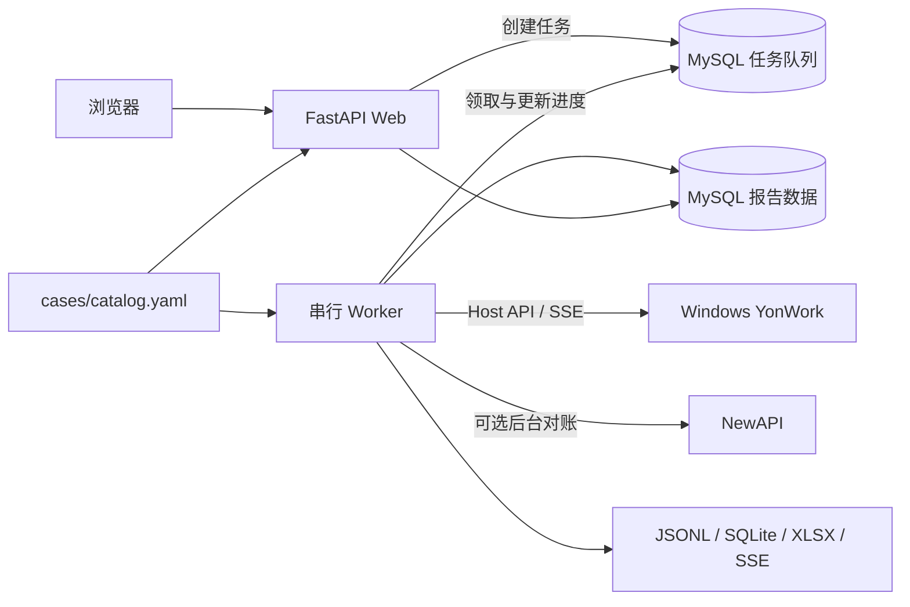

# 基础设施与前端测试集成改造总结

> 更新时间：2026-09-21  
> 范围：YAML 用例管理、Web 测试控制台、持久任务队列、Docker 一键环境和旧数据迁移。
> 记录时状态：初始仓库已推送；本文所述实现仍在本地工作区，尚未提交和推送。

## 一、改造结果

项目已从“命令行跑批 + 只读报告页”升级为“Docker 一键基础设施 + Web 测试控制台 +
持久任务队列”。Windows 侧只要求 YonWork 已安装、正在运行并已登录，测试的创建、执行、
结果汇总和报告查看均可在浏览器中完成。

用例定义不再依赖 `yonwork_benchmark.xlsx`。`cases/catalog.yaml` 是默认主用例源，Excel 仅保留
作历史查看和 CLI 兼容入口。数据库保存任务状态与结果，不保存当前用例定义；用例版本由 Git
管理，逐轮执行事实仍保存在 `results/*/results.jsonl`。

## 二、当前架构



统一 Compose 包含四个服务：

| 服务 | 职责 | 持久化 |
|---|---|---|
| `mysql` | 任务队列和报告查询数据 | `infra/data/` |
| `new-api` | 被测模型网关及后台用量来源 | `newapi/data/`、`newapi/logs/` |
| `web` | 创建任务、查看进度和报告 | 无独立状态 |
| `worker` | 串行执行测试、汇总、入库和对账 | `results/` |

YonWork 是 Windows 桌面应用，不进入容器。Web 和 Worker 使用 host network，经 WSL mirrored
网络访问 Windows loopback，并从挂载的 `%APPDATA%/yonwork/host-api-runtime.json` 动态读取
Host API 端口和 Token。

## 三、用例管理改造

### 3.1 YAML 成为主数据源

新增 `cases/catalog.yaml`，已经迁移原工作簿中的基础冒烟和长文本用例。Catalog 支持：

- 多个命名 Case Set；
- Case ID、Prompt、执行次数和启用状态；
- `expect`、`forbid`、`min_length`、`json_parsable`；
- `max_seconds`、`max_total_tokens`；
- `${ENV_NAME}` 形式的本机环境变量占位符。

Catalog 采用严格校验：未知字段、重复 ID、非法类型、非法次数和启用用例缺少环境变量都会在
测试开始前报错。禁用用例引用的本机变量不会阻塞其他可执行用例。

长文本用例不再包含旧机器用户名和固定路径，而是使用 `${YONWORK_XIYOUJI_PATH}`。
初始化脚本会将 fixture 复制到 Windows Documents，并把实际 Windows 路径写入本机 `.env`。

### 3.2 CLI 兼容

Runner 默认使用 YAML：

```bash
.venv/bin/python -m runner --case-set smoke --dry-run
.venv/bin/python -m runner --case-set long-text
```

旧 Excel 仍可显式使用：

```bash
.venv/bin/python -m runner \
  --workbook cases/yonwork_benchmark.xlsx \
  --sheet Cases
```

Excel 不再作为前端或默认 CLI 的输入源，也不再回写新测试结果。

## 四、Web 测试控制台

原 Web 只读报告层已扩展为测试控制台，同时保留既有报告能力。

新增页面与接口：

| 路由 | 作用 |
|---|---|
| `/jobs/new` | 检查 YonWork、选择 Case Set 和模型、创建任务 |
| `/jobs` | 查看最近任务 |
| `/jobs/{id}` | 查看状态、进度、事件和报告入口 |
| `/jobs/{id}/status` | 浏览器局部轮询任务状态 |
| `/jobs/{id}/cancel` | 请求停止任务 |
| `/healthz` | 容器健康检查 |

新建任务页面会：

- 检查 Host API 健康状态和登录态；
- 动态读取可选模型；
- 显示 Case 数量、总轮次和环境变量要求；
- 在 YonWork 未就绪或 Catalog 无效时禁用提交；
- 在入队前验证所选 Case Set 的机器相关变量。

任务详情页每两秒轮询一次，显示状态、进度、模型、Case Set 和执行事件；任务进入
`Completed`、`Failed` 或 `Cancelled` 后停止轮询。外部 HTMX CDN 已移除，交互使用仓库内的
原生 JavaScript，因此离线环境不依赖第三方前端资源。

轮询容忍瞬时失败：连续失败 5 次才停止，失败提示写在状态容器**外面**。容器里装着进度条、报告
链接和「停止任务」按钮，一次抖动就把它整个换成错误文字，等于在最需要停止任务的时候把按钮拿走。

## 五、持久任务队列与 Worker

MySQL 新增：

- `benchmark_jobs`：任务参数、状态、进度、产物和错误；
- `benchmark_job_events`：任务执行事件。

任务状态固定为：

- `Queued`
- `Running`
- `Completed`
- `Failed`
- `Cancelled`

**全局只允许一个 Worker。** 启动时先用 MySQL 会话级 `GET_LOCK` 拿独占锁，拿不到就打印原因并以
退出码 2 退出。这不是运维约定而是正确性前提：NewAPI 后台用量按时间窗匹配，并发跑批会张冠李戴
（第十节第 5 条）。这把锁同时也是「收拢遗留 `Running` 任务」那一步成立的依据——持锁期间没有别人
在跑，此刻还挂着 `Running` 的任务一定是上次异常退出留下的。锁绑在连接上，Worker 被强杀也会自动
释放，不需要人工清理。

Worker 使用 MySQL 8 的 `FOR UPDATE SKIP LOCKED` 原子领取任务。一个任务的完整流程为：

1. 加载并解析 Case Set；
2. 计算实际执行轮次并写入总进度；
3. 检查 YonWork 健康状态和登录态；
4. 解析用户选择的模型，或使用智能体默认模型；
5. 串行执行每一轮，每轮使用全新 `sessionKey`；
6. 每轮立即追加 JSONL 和 SSE transcript；
7. 更新已完成轮次；
8. 生成 SQLite 和可选 XLSX；
9. 幂等写入 MySQL 报告库；
10. 补采 session JSONL 用量；
11. 尝试完成 NewAPI 后台对账；
12. 写入终态和报告链接。

停止采用协作式行为：等待当前单轮收尾后，不再开启下一轮，避免产生半截 SSE 和无法解释的
结果。Docker 停止 Worker 时给予当前轮最多 11 分钟收尾时间；若任务只完成了一部分，会保留
已有产物并标记失败。Worker 重启时会收拢异常退出留下的 `Running` 任务，避免永久卡住。

Web 重启不会影响独立 Worker 中正在执行的任务，排队任务也不会因页面关闭而丢失。

## 六、Docker 一键环境

根目录新增：

- `Dockerfile`
- `compose.yml`
- `.dockerignore`
- `.env.example`
- `scripts/bootstrap.sh`

Web 和 Worker 共用一份 `yonwork-benchmark:local` 镜像，避免并行构建两份相同镜像造成重复开销
和 Docker snapshot 冲突。镜像使用非 root 用户运行，UID/GID 与宿主机保持一致，使 `results/`
bind mount 可以正常写入。

Compose 提供：

- MySQL、NewAPI 和 Web 健康检查；
- `unless-stopped` 自动重启；
- MySQL 和 NewAPI 数据持久化；
- `cases/` 只读挂载；
- `results/` 可写挂载；
- YonWork 数据目录只读挂载；
- Web 和 Worker 的共享环境变量；
- NewAPI 已验证版本的镜像摘要固定。

## 七、初始化和旧环境迁移

换机后，在 YonWork 已安装并至少启动过一次的前提下运行：

```bash
./scripts/bootstrap.sh
```

脚本会：

1. 检查 Docker、Compose 和 OpenSSL；
2. 自动定位 `%APPDATA%/yonwork`；
3. 将长文本 fixture 复制到 Windows Documents；
4. 生成权限为 `600` 的根目录 `.env`；
5. 新机器生成随机 MySQL 密码和 Session Secret；
6. 老机器继承 `infra/.env`、NewAPI token 和已有容器中的 Session Secret；
7. 在已有 MySQL 数据但无法恢复旧密码时主动停止，避免锁死数据；
8. 预先创建 bind mount 目录，避免 Docker 创建成 root 所有；
9. 在停止旧服务前完成镜像拉取和应用构建；
10. 识别并无损接管旧 `infra`、`newapi` Compose；
11. 启动统一 Compose 并等待服务健康；
12. 打印测试控制台地址。

脚本已经在原有 MySQL/NewAPI 数据存在的机器上执行验证：旧容器被替换，bind mount 数据和旧
报告均保留。随后再次执行也能正常完成，确认具备幂等性。

## 八、配置兼容与依赖调整

配置读取已统一：

- Docker 环境由根目录 `.env` 注入；
- 本地 CLI、Web 和 Worker也会读取根目录 `.env`；
- 继续兼容旧 `infra/.env` 和 `newapi/credentials.env`；
- 真实环境变量拥有最高优先级；
- `YONWORK_RUNTIME_HOST` 允许按容器网络覆盖 Host API 主机地址；
- Host API 端口始终从运行时文件动态读取，不硬编码 3211。

依赖调整：

- 修正不可安装的旧 PyMySQL 版本；
- 固定 Jinja2 和 Uvicorn；
- 新增 PyYAML；
- 新增 `python-multipart` 支持 FastAPI 表单；
- 保留 openpyxl 作为旧 Excel 输入和结果导出依赖。

## 九、测试和验证

新增或扩展了以下测试：

- YAML Catalog 解析和严格字段校验；
- 环境变量替换与禁用用例行为；
- 容器 Host 地址覆盖；
- Batch 进度回调和协作式停止；
- Worker 正常完成、停止信号处理和取消按钮（终态 `Cancelled` 而非 `Failed`）；
- Worker 独占锁：第二个实例被拒绝，临界区抛异常时锁仍被释放；
- Web 健康检查、新建任务、提交任务和终态轮询；
- 数字表单域为空时回落默认值、非数字时重渲染表单而不是 422；
- SQLite 测试连接资源释放。

最终验证结果：

| 检查 | 结果 |
|---|---|
| Runner 离线测试 | 111 个通过 |
| Web 离线测试 | 6 个通过 |
| Python 编译检查 | 通过 |
| JavaScript 语法检查 | 通过 |
| Bootstrap Shell 语法 | 通过 |
| Compose 配置校验 | 通过 |
| Docker 镜像构建 | 通过 |
| 容器内完整测试 | 通过 |
| Web 健康、任务和报告页面 | HTTP 200 |
| 旧 MySQL 报告数据 | 迁移后可读取 |
| Bootstrap 重复执行 | 通过 |

## 十、当前边界和后续工作

1. YonWork 必须在 Windows 侧安装、运行并登录；当前不会自动安装或启动 GUI 应用。
2. 当前网络实现依赖 WSL mirrored 网络和 WSL 内原生 Docker。普通 WSL NAT 或未启用 host
   networking 的 Docker Desktop 需要调整宿主机访问方式。
3. 新主机首次使用 NewAPI 时，仍需初始化管理员、渠道和系统访问 Token；默认 YonWork 模型
   不依赖这一步。
4. 一个 Web 任务目前运行一个模型模式。相同实验名称可以聚合比较多个任务，但跨模式一键展开
   尚未实现。
5. NewAPI 后台用量仍按时间窗匹配，因此 Worker 保持串行；实现 runId 透传前不能并发跑批。
6. WorkBuddy 尚未找到可编程入口，仍使用 `benchmark-companion/` 的人工流程。
7. 测试用例当前由 YAML + Git 管理，结果由 JSONL + MySQL 管理；不计划把可编辑用例迁入数据库。

## 十一、关键文件索引

| 文件 | 说明 |
|---|---|
| `cases/catalog.yaml` | 主用例源 |
| `runner/case_catalog.py` | Catalog 读取、校验和变量解析 |
| `runner/job_store.py` | MySQL 任务队列 |
| `runner/worker.py` | Web 任务执行器 |
| `runner/batch.py` | 单轮隔离、进度回调、停止检查 |
| `web/api.py` | 测试控制台和报告接口 |
| `web/templates/new_job.html` | 新建任务页面 |
| `web/templates/job.html` | 任务详情页面 |
| `web/static/app.js` | 状态轮询和局部加载 |
| `infra/schema.sql` | 报告与任务表结构 |
| `compose.yml` | 统一四服务环境 |
| `Dockerfile` | Web/Worker 共享镜像 |
| `scripts/bootstrap.sh` | 换机初始化和旧环境迁移 |
